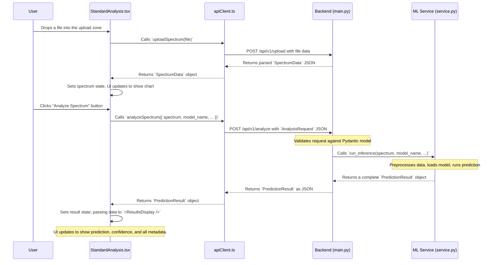

AI-Driven Polymer Aging Prediction and Classification (v0.2)
============================================================

[](LICENSE)


This web application classifies the degradation state of polymers using **Raman and FTIR spectroscopy** and deep learning.
It features a modern **React frontend** with a **FastAPI backend** for production-ready deployment with full scientific provenance tracking.
This document serves as a Good Reference Note (GRN) baseline for the `ml-polymer-recycling` project. It provides a comprehensive snapshot of the system architecture, component interactions, and data flow as of this version.

---

## Current Scope

## 1. Project Overview

- **Modalities**: Raman & FTIR spectroscopy
- **Input Formats**: `.txt`, `.csv`, `.json` (with auto-detection)
- **Models**: Figure2CNN (baseline), ResNet1D, ResNet18Vision, Custom CNNs (Enhanced, Efficient, Hybrid)
- **Task**: Binary classification — Stable vs Weathered polymers
- **Features**:
  - Single-spectrum + Batch Spectrum Analysis
  - Multi-model comparison
  - Performance tracking dashboard
  - **Full provenance tracking** (QC checks, preprocessing parameters, model metadata)
  - **RESTful API** for programmatic access
- **Architecture**: React + FastAPI + PyTorch
  This project is a full-stack web application that uses Artificial Intelligence to analyze chemical data from plastics and polymers. Users can upload their own scientific data (a spectrum from Raman or FTIR spectroscopy) and the AI will predict whether the material is **stable** (unweathered) or has been **weathered** (degraded).

The platform also provides advanced features:

- **Model Comparison:** Allows users to run an analysis using multiple different AI models and compare their predictions.
- **AI Explainability:** Provides a deep dive into _why_ the AI made a specific decision, highlighting the spectral regions that most influenced the outcome.
- **Performance Tracking:** Offers a dashboard to monitor the health of the backend system and the performance metrics of the loaded AI models.

---

## Architecture

## 2. Table of Contents

**Modern single-container deployment with complete separation of concerns:**

- **Frontend**: React TypeScript application with Material Design-inspired UI
- **Backend**: FastAPI with comprehensive ML inference pipeline
- **API Contract**: Strict Pydantic models for all request/response validation
- **Scientific Fidelity**: Exact preservation of original Streamlit ML logic
- **Full Provenance**: Every prediction includes QC checks, preprocessing details, and model metadata
- **Single Port**: Both frontend and API served on the same port for Hugging Face Spaces compatibility
- 1. Project Overview
- 2. Table of Contents
- 3. Technology Stack
- 4. Project Structure
- 5. Setup and Installation
- 6. Architectural Deep Dive
  - 6.1. React Component Architecture
  - 6.2. API Endpoint Layer
  - 6.3. API Data Contracts
  - 6.4. ML Inference Service
  - 6.5. Transparent AI & Explainability
  - 6.6. Model Registry
- 7. Component & API Mapping
  - 7.1. Frontend Component Guide
- 8. Data Flow Example: Standard Analysis
- 9. Developer Workflow Guide

---

## How to Use

## 3. Technology Stack

The application provides three main analysis modes:

### 1. **Standard Analysis**

- Upload a single spectrum file (`.txt`, `.csv`, `.json`)
- Choose a model and spectroscopy modality
- Get detailed predictions with full provenance metadata
- View spectrum processing visualization

### 2. **Model Comparison**

- Upload a single spectrum file
- Compare predictions from all available models
- View consensus predictions and model agreement metrics
- Analyze confidence variance across models

### 3. **Performance Tracking**

- Monitor system health and model performance
- View detailed model specifications and availability
- Track memory usage and processing capabilities

### Supported Input

- Plaintext `.txt`, `.csv`, or `.json` files
- Data can be space-, comma-, or tab-separated
- Comment lines (`#`, `%`) are ignored
- Automatic format detection and resampling to standard length

| Area     | Technology             | Description                                                               |
| :------- | :--------------------- | :------------------------------------------------------------------------ |
| Backend  | **Python 3.10+**       | Core programming language.                                                |
|          | **FastAPI**            | High-performance web framework for building the API.                      |
|          | **Pydantic**           | Data validation and settings management (defines API Data Contracts).     |
|          | **PyTorch**            | The deep learning framework used to build and run the AI models.          |
|          | **NumPy** & **SciPy**  | Libraries for numerical operations and scientific data processing.        |
|          | **Uvicorn**            | ASGI server that runs the FastAPI application.                            |
| Frontend | **TypeScript**         | Superset of JavaScript that adds static typing for robustness.            |
|          | **React**              | A component-based library for building the user interface.                |
|          | **Recharts**           | A composable charting library for visualizing spectrum data.              |
|          | **openapi-typescript** | Tool to auto-generate TypeScript types from the backend's OpenAPI schema. |

---

## API Documentation

The API is documented using the OpenAPI standard. When the application is running, you can access the live, interactive documentation (Swagger UI) to explore and test all available endpoints. This is the single source of truth for the API.

- **URL**: [`http://localhost:8000/api/v1/docs`](http://localhost:8000/api/v1/docs)

## 4. Project Structure

The project is a monorepo containing both the `backend` and `frontend` in a single directory.

```text
ml-polymer-recycling/
├── backend/
│   ├── main.py             # FastAPI app: API endpoints, middleware, static file serving.
│   ├── service.py          # Core MLInferenceService: handles all analysis logic.
│   ├── models.py           # Pydantic models: defines the API data contracts.
│   ├── utils/
│   │   ├── preprocessing.py  # Spectrum cleaning and standardization functions.
│   │   └── enhanced_ml_service.py # Logic for the explainability features.
│   └── models/
│       ├── registry.py       # The Model Registry for managing different AI models.
│       └── figure2_cnn.py    # Example implementation of a CNN model.
├── frontend/
│   ├── src/
│   │   ├── App.tsx           # Main React component, manages layout and tabs.
│   │   ├── apiClient.ts      # Central API client for all frontend-backend communication.
│   │   ├── components/       # Directory for all reusable React components.
│   │   │   ├── Sidebar.tsx
│   │   │   ├── StandardAnalysis.tsx
│   │   │   ├── ResultsDisplay.tsx
│   │   │   └── ... (other components)
│   │   └── types/
│   │       └── api.ts        # Auto-generated TypeScript types from the backend API.
│   ├── public/
│   └── package.json          # Frontend dependencies and scripts.
├── main.py                   # Main entry point to start the application server.
└── openapi-schema.json       # The OpenAPI specification generated by FastAPI.
```

## **API Documentation**: Available at `/api/docs` when running

## 5. Setup and Installation

### Prerequisites

- **Python 3.10+** and `pip`
- **Node.js 16+** and `npm`

### 1. Backend Setup

From the project root directory, install the required Python packages:

```bash
pip install -r backend/requirements.txt
```

### 2. Frontend Setup

Navigate to the frontend directory and install the Node.js dependencies:

```bash
cd frontend
npm install
cd ..
```

### 3. Running the Application

The application is designed for a single-container deployment. The `main.py` script at the root will automatically build the frontend (if needed) and start the backend server, which also serves the frontend files.

From the project root directory, run:

```bash
python main.py
```

You can now access the application at `http://localhost:8000`.

---

## 🔧 Development & Deployment

## 6. Architectural Deep Dive

### Local Development

This section provides a high-level overview of the core architectural concepts that power this application.

For the frontend to connect to the backend, you'll need to set an environment variable.

### 6.1. React Component Architecture

1.  **Configure API URL**:
    Create a file named `.env.development` in the `frontend` directory with the following content:
    `   REACT_APP_API_BASE_URL=http://localhost:8000`
    The frontend user interface is built using React. The core idea is to build everything from small, independent, and reusable pieces called **components**.

2.  **Run Backend**:
    ```bash
    # Backend development
    python main.py
    ```

- **Independent:** A component manages its own logic and appearance (e.g., `SpectrumChart`).
- **Reusable:** A component can be used in many different places (e.g., a `Button` or `Spinner`).
- **Composable:** Simple components are combined to build more complex structures.

3.  **Run Frontend**:
    `bash
    # Frontend development (separate terminal)
    cd frontend
    npm start
    `The main file,`frontend/src/App.tsx`, assembles the page layout by composing high-level components like `<Header />`, `<Sidebar />`, and the main tab components (`<StandardAnalysis />`, `<ModelComparison />`, etc.). It uses a **state** variable (`activeTab`) to manage which view is currently visible, making the UI interactive.

**Build for Production**:

```bash
# Build for production
cd frontend
npm run build
python main.py  # Serves both frontend and API
```

### 6.2. API Endpoint Layer

### Docker Deployment

The frontend (in the browser) cannot run the AI models directly. It communicates with the backend via an **API (Application Programming Interface)**. The API defines a "menu" of services the backend offers at specific URLs, called **endpoints**.

```bash
# Single-container deployment
docker build -t polymer-aging-ml .
docker run -p 8000:8000 polymer-aging-ml
```

- `GET /api/v1/models`: Asks the backend for the list of available models.
- `POST /api/v1/analyze`: Sends a spectrum to the backend to be analyzed.

### Hugging Face Spaces

The backend uses the **FastAPI** framework to create these endpoints. An endpoint's job is to manage communication, not to do the core work. It receives a request, delegates the task to a service (like the `MLInferenceService`), and returns the final response.

The application is designed for single-container deployment on Hugging Face Spaces:

### 6.3. API Data Contracts

- Uses Docker SDK with port 8000
- Serves React frontend and FastAPI backend on the same port
- Optimized build process with multi-stage Docker builds
  To prevent miscommunication, the frontend and backend agree on a strict **Data Contract**—a blueprint that defines the exact structure of the data they exchange.

---

- **Backend (Pydantic):** In `backend/models.py`, we use Pydantic models to define the expected structure of requests and responses. FastAPI uses these models to automatically validate all incoming data.
- **Frontend (TypeScript):** In `frontend/src/types/api.ts`, we have TypeScript interfaces that are auto-generated from the backend's OpenAPI schema. This ensures the frontend always creates data that conforms to the contract.

## Contributors

This dual-blueprint system guarantees that the "data door" built by the frontend will always fit the "data doorframe" expected by the backend.

- Dr. Sanmukh Kuppannagari (Mentor)
- Dr. Metin Karailyan (Mentor)
- Jaser Hasan (Author/Developer)

### 6.4. ML Inference Service

## Model Credit

The `MLInferenceService` (in `backend/service.py`) is the core scientific engine of the application. It encapsulates the entire analysis workflow:

Baseline model inspired by:

1.  **Receive** the raw spectrum data.
2.  **Preprocess** the data (baseline correction, resampling, normalization).
3.  **Load** the correct AI model from the Model Registry.
4.  **Run Inference** to get a prediction from the model.
5.  **Package the Result** with rich **provenance metadata**, documenting every step of the process for scientific validity and reproducibility.

Neo, E.R.K., Low, J.S.C., Goodship, V., Debattista, K. (2023).
_Deep learning for chemometric analysis of plastic spectral data from infrared and Raman databases._
_Resources, Conservation & Recycling_, **188**, 106718.
https://doi.org/10.1016/j.resconrec.2022.106718
This service separates the complex scientific logic from the web-serving logic of the API endpoints.

---

### 6.5. Transparent AI & Explainability

## 🔗 Links

To avoid being a "black box," the system includes an explainability engine (`enhanced_ml_service.py`). When a user requests an explanation, this service goes beyond a simple prediction and provides deeper insights:

- **Live App**: Hugging Face Space
- **GitHub Repo**: ml-polymer-recycling
- **Feature Importance:** It identifies which parts of the spectrum were most influential in the model's decision.
- **Uncertainty Quantification:** It can estimate how confident the model is and why.

---

This turns the AI from a simple calculator into an expert consultant, making the results more trustworthy and useful for scientific research.

Technical Architecture

### 6.6. Model Registry

**Production-ready architecture with complete separation of concerns:**
To manage a growing collection of different AI models, the project uses a **Model Registry** (`models/registry.py`). This acts as a central "toolbox" or catalog for all available model architectures.

### Frontend (React TypeScript)

Instead of hard-coding a specific model, the `MLInferenceService` can ask the registry for a model by its simple name (e.g., `"figure2"` or `"resnet"`). The registry handles the details of finding and constructing the correct model object. This makes the system highly flexible and easy to extend with new models.

- **UI Framework**: React 18 with TypeScript for type safety
- **Styling**: Custom CSS matching original Streamlit design language
- **Charts**: Recharts for spectrum visualization
- **File Upload**: React Dropzone for drag-and-drop functionality
- **API Client**: Axios with comprehensive error handling
- **Responsive Design**: Mobile-friendly interface

---

### Backend (FastAPI)

## 7. Component & API Mapping

- **API Framework**: FastAPI with automatic OpenAPI documentation
- **ML Pipeline**: Preserved original PyTorch inference logic
- **Validation**: Pydantic models for strict request/response contracts
- **Provenance**: Complete metadata tracking for scientific reproducibility
- **Performance**: Async processing with memory management
- **Models**: Registry pattern for dynamic model loading

### 7.1. Frontend Component Guide

### Scientific Fidelity

| Component (`/src/components/`) | Description                                                                                                                                | Key Interactions                                                                                              |
| :----------------------------- | :----------------------------------------------------------------------------------------------------------------------------------------- | :------------------------------------------------------------------------------------------------------------ |
| **`App.tsx`**                  | The main application shell. Manages the overall layout and which tab is currently active. Holds the global `spectrumData` state.           | Renders `Sidebar`, `Header`, and the active tab component. Lifts state up from `StandardAnalysis`.            |
| `Header.tsx`                   | A simple, static component that displays the application title and subtitle.                                                               | None.                                                                                                         |
| `Sidebar.tsx`                  | Allows the user to select the AI model and spectroscopy modality (`raman`/`ftir`). Displays detailed information about the selected model. | Fetches model list via `apiClient.getModels()`. Updates `selectedModel` and `modality` state in `App.tsx`.    |
| `StandardAnalysis.tsx`         | The primary analysis tab. Manages file upload, analysis execution, and displaying results for a single spectrum.                           | Uses `react-dropzone` for uploads. Calls `apiClient.uploadSpectrum()` and `apiClient.analyzeSpectrum()`.      |
| `ModelComparison.tsx`          | UI for selecting multiple models to compare against a single spectrum. Fetches available models and allows user selection.                 | Calls `apiClient.compareModels()`. **Note:** The UI for displaying comparison results is not yet implemented. |
| `PerformanceTracking.tsx`      | A dashboard that displays system health and detailed performance metrics for all available models.                                         | Fetches data by calling `apiClient.getSystemInfo()`.                                                          |
| `ExplainabilityPanel.tsx`      | The "AI Explainability" tab. Allows the user to run an analysis that generates feature importance and other insights.                      | Uses the shared `spectrumData` from `App.tsx`. Calls `apiClient.explainSpectrum()`.                           |
| `ResultsDisplay.tsx`           | A detailed component that takes a `PredictionResult` object and renders all its information in a user-friendly format.                     | Renders class probabilities, performance metrics, and metadata. Uses `SpectrumChart` for visualization.       |
| `SpectrumChart.tsx`            | A reusable chart component that visualizes spectrum data using the `recharts` library. Can display original and processed spectra.         | Receives `SpectrumData` as props and renders a `LineChart`.                                                   |

- **Exact Preservation**: All ML inference logic preserved from original Streamlit app
- **Deterministic Outputs**: Identical results to original application
- **Quality Control**: Comprehensive spectrum validation and QC checks
- **Preprocessing**: Complete preprocessing pipeline with metadata tracking
- **Model Metadata**: Full model provenance including training metrics

### 7.2. Backend API Endpoint Guide

### Deployment

| API Endpoint (`/api/v1/...`)  | Method | Description                                                                                               | Service Function Called (backend)                |
| :---------------------------- | :----- | :-------------------------------------------------------------------------------------------------------- | :----------------------------------------------- |
| `/api/v1/system`              | `GET`  | Retrieves comprehensive system information, including loaded models, performance, and health metrics.     | `ml_service.get_system_info()`                   |
| `/api/v1/models`              | `GET`  | Returns a list of all available models and their metadata.                                                | `ml_service.get_available_models()`              |
| `/api/v1/upload`              | `POST` | Uploads a spectrum file (`.txt`, `.csv`, `.json`) and parses it into the standard `SpectrumData` format.  | `utils.parse_spectrum_data()` (indirectly)       |
| `/api/v1/analyze`             | `POST` | Analyzes a single spectrum using a specified model and returns a detailed `PredictionResult`.             | `ml_service.run_inference()`                     |
| `/api/v1/compare`             | `POST` | Compares multiple models on a single spectrum and returns a `ComparisonResult`.                           | `ml_service.run_inference()` (in a loop)         |
| `/api/v1/explain`             | `POST` | Analyzes a spectrum and returns an enriched result with feature importance and other explainability data. | `enhanced_ml_service.py: predict_with_explanation()` |

- **Single Container**: React frontend and FastAPI backend in one Docker image
- **Multi-stage Build**: Optimized Docker builds for production
- **Static Serving**: FastAPI serves React static files efficiently
- **Health Checks**: Comprehensive monitoring and health endpoints
- **Port Unification**: Both UI and API on port 8000 for Hugging Face Spaces

---

## 8. Data Flow Example: Standard Analysis

## Notable Features in v0.2

This diagram illustrates the end-to-end journey of a request when a user uploads a file and clicks "Analyze".

- **Complete Architecture Transformation**: Streamlit → React + FastAPI
- **Scientific Fidelity Preservation**: Exact ML behavior maintained
- **Full Provenance Tracking**: QC checks, preprocessing parameters, model metadata
- **RESTful API**: Programmatic access to all functionality
- **Single-Container Deployment**: Optimized for Hugging Face Spaces
- **Type Safety**: Full TypeScript implementation
- **Professional UI**: Production-ready interface design
- **Comprehensive Testing**: API validation and frontend testing
- **Performance Optimization**: Async processing and memory management
- **Documentation**: Auto-generated API docs and comprehensive README



---

## 9. Developer Workflow Guide

This section outlines common development tasks and best practices for this project.

### How to Add a New Model

1.  **Create the Model File**: Add your PyTorch model class to a new file in `backend/models/` (e.g., `my_new_cnn.py`).
2.  **Register the Model**: In `backend/models/registry.py`:
    - Import your new model class.
    - Add a new entry to the `_REGISTRY` dictionary with a unique key and a lambda function to instantiate your model.
    - Add a corresponding entry to the `_MODEL_SPECS` dictionary with its metadata (description, performance, etc.).
3.  **Add Weights**: Place the trained model weights (`.pth` file) in the `backend/model_weights/` directory, ensuring the filename matches the key you used in the registry (e.g., `my_new_cnn_model.pth`).
4.  **Verify**: Restart the application. The new model should automatically appear in the "Select Model" dropdown in the UI.

How to Add a New API Endpoint

1. **Backend (`models.py`)**: Define the Pydantic models for the request body and response. This enforces the data contract.
2. **Backend (`service.py`)**: Add the core business logic for the new feature into a new method in the `MLInferenceService`.
3. **Backend (`main.py`)**: Create a new FastAPI route (e.g., `@app.post("/api/v1/my-new-endpoint")`) that takes the request model, calls the new service method, and returns the response model.
4. **Update API Schema**: After adding the endpoint, regenerate the `openapi-schema.json` file. You can do this by running the app and copying the JSON from `http://localhost:8000/api/v1/openapi.json`.
5. **Update Frontend Types**: Run the `openapi-typescript` tool to regenerate `frontend/src/types/api.ts` from the new schema.

   ```bash
   npx openapi-typescript openapi-schema.json --output frontend/src/types/api.ts
   ```

6. **Frontend (`apiClient.ts`)**: Add a new method to the `ApiClient` class that calls the new endpoint and uses the newly generated TypeScript types.
7. **Frontend (Component)**: Create or update a React component to call the new `apiClient` method and display the results.
