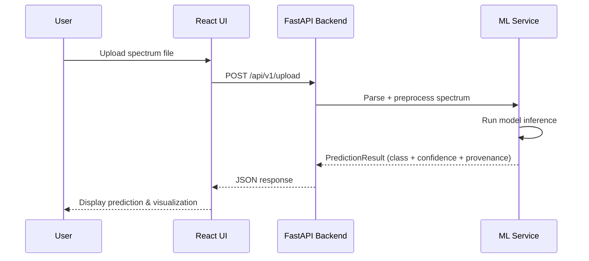

# PolymerOS: AI-Driven Polymer Aging Prediction and Classification


---

## 🌍 Overview

**PolymerOS** is a full-stack AI application that classifies the degradation state of polymers using **Raman** and **FTIR spectroscopy**.
It enables scientists, engineers, and researchers to upload spectroscopic data and receive predictions on whether materials are **stable (unweathered)** or **weathered (degraded)**.

This platform was designed for both research reproducibility and production-grade deployment. Every prediction includes **scientific provenance tracking**, ensuring transparency in preprocessing, QC checks, and model metadata.

---

## ✨ Features

- 🔬 **Multi-Modal Input**: Supports Raman and FTIR data
- 📂 **Flexible File Formats**: Accepts `.txt`, `.csv`, `.json` (auto-detected)
- 🤖 **Model Zoo**: Figure2CNN, ResNet1D, ResNet18Vision, and custom CNNs
- 📊 **Batch & Single-Spectrum Analysis**
- ⚖️ **Multi-Model Comparison**
- 🧾 **Provenance Tracking**: QC checks + preprocessing metadata
- 📈 **Performance Dashboard**
- 📡 **RESTful API** for programmatic access
- 🎨 **Modern UI**: React + TypeScript, charting with Recharts

---

## 🏛 Architecture

PolymerOS is a **monorepo** with a React frontend and FastAPI backend, packaged for **single-container deployment**.

```text
polymeros/
├── backend/
│   ├── main.py               # FastAPI entrypoint: routes, middleware, startup
│   ├── service.py            # Core MLInferenceService logic
│   ├── pydantic_models.py    # API contracts for request/response validation
│   ├── utils/                # Preprocessing, performance, orchestration
│   └── models/
│       ├── registry.py       # Model registry for AI models
│       └── figure2_cnn.py    # Example CNN implementation
├── frontend/
│   ├── src/
│   │   ├── App.tsx           # Main React app shell
│   │   ├── apiClient.ts      # Centralized API calls
│   │   ├── components/       # Reusable UI components
│   │   └── types/api.ts      # Auto-generated TypeScript types
│   └── package.json
├── models/weights/           # Directory for trained model weights (.pth)
├── Dockerfile                # Multi-stage build for backend+frontend
└── main.py                   # Root entrypoint: serves frontend + backend
```

---

## 📡 Data Flow

Example: Standard Spectrum Analysis



---

## 🛠 Getting Started

### Prerequisites

- Python 3.10+
- Node.js 16+
- npm
- Git

### Setup

```bash
# Clone repo
git clone https://github.com/devjas1/polymeros.git
cd polymeros

# Backend setup
pip install -r backend/requirements.txt

# Frontend setup
cd frontend
npm install
cd ..
```

### Run (Dev Mode)

```bash
# Backend (FastAPI with live reload)
uvicorn backend.main:app --reload --port 8000

# Frontend (React)
cd frontend
npm start
```

### Run (Single-Container)

```bash
python main.py
```

Access the app at: **http://localhost:8000**

---

## Tests

```bash
# From repo root
export PYTHONPATH=$PWD
pytest backend/tests
```

---

## Deployment

### Docker

```bash
docker build -t polymeros .
docker run -p 8000:8000 polymeros
```

### Hugging Face Spaces

PolymerOS is optimized for deployment on Hugging Face Spaces with unified API + UI on a single port.

---

## Contributors

- **Jaser Hasan** — Author & Developer
- **Dr. Sanmukh Kuppannagari** — Mentor
- **Dr. Metin Karailyan** — Mentor

---

## 📜 License

Apache 2.0 — see [LICENSE](LICENSE)

---
